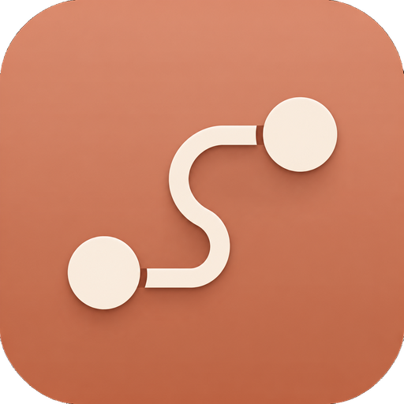
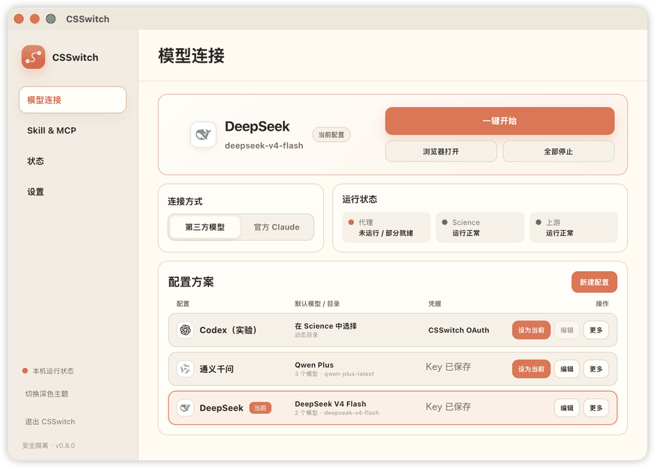

<p align="center">
  
</p>

<p align="center">
  <strong>README</strong>
</p>

<p align="center">
  <a href="https://github.com/SuperJJ007/CSSwitch"></a>
  <a href="./LICENSE"></a>
  
  
</p>

<p align="center">
  <strong>更自由、流畅的研究体验。</strong>
</p>

<p align="center">
  CSSwitch 让 Claude Science 接入你自己的模型 API。<br>
  在主流 Provider 与自定义兼容端点之间自由切换。
</p>

<p align="center">
  
</p>

---

<p align="center">
  <a href="#功能介绍">功能介绍</a> ·
  <a href="#安装与启动">安装与启动</a> ·
  <a href="#provider-与模型">Provider 与模型</a> ·
  <a href="#skill">Skill</a> ·
  <a href="#mcp">MCP</a> ·
  <a href="#开发">开发</a> ·
  <a href="#windows-移植交接备注">移植交接备注</a>
</p>

## 功能介绍

| 功能 | 当前状态 | 说明 |
| --- | --- | --- |
| Provider 与模型 | 已支持 | 连接内置 Provider、中转站和自定义兼容端点，自由填写并严格映射 Science 使用的模型。 |
| Skill | 已支持 | 查看当前 Science 组织中的 Skill，从本地包导入，或让 Agent 从准确的公开 GitHub URL 安装。 |
| MCP | 即将支持 | v0.8.4 尚未提供面向用户的通用 MCP 添加、配置和运行管理；后续版本会继续完善。 |

## 社区

<p align="center">
  
</p>

## 安装与启动

需要一台 Windows 10/11 64 位电脑、已安装的 [Claude Science](https://claude.com/download)，以及可用的第三方模型 API Key。

### 安装

本版本从源码构建，产物为 `desktop/src-tauri/target/release/bundle/` 下的 `nsis/CSSwitch_0.8.4_x64-setup.exe` 或 `msi/CSSwitch_0.8.4_x64_en-US.msi`（构建方法见[开发](#开发)）。

1. 先安装并**启动过一次** [Claude Science Windows 版](https://claude.com/download)（首次启动会生成沙箱所需的运行时与 conda 环境）。
2. 运行安装包。系统缺 WebView2 Runtime 时安装器会自动引导下载（Win11 通常已内置）。
3. 未签名构建首次运行会被 SmartScreen 拦截：点「更多信息 → 仍要运行」。
4. 打开 CSSwitch，在「模型连接」填写 Provider 与 API Key 并「设为当前」，回首页点「一键开始」——沙箱准备、代登录（虚拟账号）会自动完成。

安装包不含任何 API Key 与 provider 配置，全部在首次使用时于界面内填写，仅保存在本机 `~/.csswitch/config.json`。

### 连接第三方模型

1. 进入「模型连接」，点击「新增配置」。
2. 选择一个内置 Provider；使用中转站或自建服务时，选择对应的兼容端点并填写 `base_url`。
3. 填写 API Key 和模型名称。默认模型必须填写；高质量、快速和 Fable 模型可以留空，也可以直接填写上游提供的精确模型 ID。
4. 保存配置并点击「设为当前」。
5. 回到首页，保持「第三方模型」模式，点击「一键开始」。
6. Science 打开后，在顶部模型选择器中选择需要的模型。CSSwitch 显示的是你配置的真实模型名。

需要回到原来的 Claude 账号和官方模型时，在首页切换到「官方 Claude」并打开 Science；CSSwitch 会先停止自己管理的第三方链路。

### 安装与查看 Skill

1. 先通过「一键开始」启动隔离 Science，等待运行状态正常。
2. 打开「Skill & MCP」，点击「刷新」查看当前 Science 组织中发现的 Skill、来源和绑定状态。
3. 本地包可以点击「导入本地 Skill 包」，选择 `.zip` 或 `.skill`；公开 GitHub Skill 则在 Science 中把准确 URL 交给 Agent，由 CSSwitch connector 完成安装。
4. 页面显示“已绑定”后，仍建议在当前 Agent 会话调用对应的 `skill()`，确认它已经实际加载。

## Provider 与模型

- **内置 Provider：** DeepSeek、通义千问、智谱 GLM、小米 MiMo、硅基流动、Kimi、MiniMax、OpenRouter。
- **自定义端点：** Anthropic Messages、OpenAI Chat Completions 和 OpenAI Responses 兼容 API；模型名称可以直接填写，不依赖自动发现。
- **模型选择：** 普通配置可只填一个模型，也可以分别设置质量、均衡、快速和 Fable。Science 显示真实模型名，不使用 `default` 占位名称。

不同 Provider 对工具调用、thinking、图片、长上下文和流式输出的支持并不相同。CSSwitch 会严格按当前配置映射模型，未知模型不会静默切换到别的模型。

## Skill

CSSwitch 当前聚焦于安全地把外部 Skill 接入隔离 Science，而不是再造一个 Skill 市场或通用 MCP 管理器。

- **查看现有 Skill：** 页面读取当前 Science 组织中真实存在的 Skill，展示来源、单 Skill / bundle 形态，以及 `attached`、`detached`、`unknown` 三种 OPERON 绑定状态。Science 未运行或身份无法确认时不会猜测结果。
- **导入本地包：** 通过系统文件选择器导入 `.zip` 或 `.skill`，自动识别单 Skill 与多 Skill bundle；前端不接收或提交本地文件路径。
- **从 GitHub 安装：** 可以让 Science Agent 通过 CSSwitch 的专用安装桥接安装准确的公开 GitHub 仓库、集合或 Skill 目录 URL。CSSwitch 宿主负责匿名下载、固定 commit、校验、提交和绑定，不使用 Science 或用户的 GitHub 凭证。
- **安全提交：** 安装前检查 archive 大小、文件数量、路径穿越、符号链接、特殊文件和名称冲突；提交过程保持原子性，同名或已被修改的内容不会被静默覆盖。
- **区分发现、绑定与加载：** 列表中“已绑定”只代表 OPERON 实时回读成功，不等于当前 Agent 会话已经加载。单 Skill 安装后仍应在 Science 中调用 `skill()` 做最终验证。
- **bundle 生命周期：** bundle 会保留 `_shared` 和支持资源；从任一成员发起卸载都必须先展示完整影响列表并由用户确认，随后才整包 detach 和隔离回收，不做成员级静默删除。

公开 GitHub Skill 安装在内部使用一个窄范围 connector，只负责安装、卸载和长任务状态查询；它是 Skill 安装链路的一部分，不代表 CSSwitch 已经支持通用 MCP。详细合同见[外部 Skill bridge](./docs/features/external-skill-bridge.md)。

## MCP

通用 MCP 支持正在开发中。当前 v0.8.4 还不能让用户在 CSSwitch 中添加、编辑或管理自己的 MCP server，也不应把 Skill 安装所用的内部 connector 当成完整 MCP 功能。后续支持范围以对应版本的 README 和更新日志为准。

## 安全与隔离

- 第三方模式使用独立 HOME、data-dir 和本地回环 Gateway，不读取或修改真实 Claude 登录与 Science 数据。
- API Key 保存在本机 `~/.csswitch/config.json`，文件权限为 `0600`；凭据不会写入日志。
- 官方 Claude 模式会停止第三方代理链路，再打开真实 Science。
- CSSwitch 不下载或自动升级 Claude Science；Windows 上直接使用当前安装的官方 App。
- 「全部停止」在停止后会一并清扫残留容器、孤儿进程与回滚快照（存在待恢复事务清单时快照保留），新装机器无需外部清理脚本。
- 「诊断与支持 → 导出诊断包」一键把应用日志、Science daemon 日志、系统/版本信息与**脱敏后的配置**（key/token 等字段替换为占位符）打成一个 zip 并在资源管理器中定位，报问题直接附包。

## 当前边界

- Windows（x86_64-pc-windows-msvc）v0.8.4 起全链路可用——登录、chat、第三方模型、web_search、文献 MCP、GitHub Skill 安装桥（连接器已在真机日志中多次连接成功）均已验证；无公开下载，需按[开发](#开发)自行构建。平台细节与构建方法见 [Windows 适配说明](./docs/windows-port.md)。
- 第三方模式不提供 Anthropic 账号权限，托管 MCP、目录连接器和部分云端能力可能不可用。
- Codex 实验功能已从本版本移除；旧配置中的 Codex 配置会在升级时被安全清除并提示。
- Rust Gateway 已随应用打包，不需要单独安装 Python runtime。

升级、回滚和已知限制见[项目文档](./docs/README.md)。问题反馈请使用 [GitHub Issues](https://github.com/SuperJJ007/CSSwitch/issues)。

## 开发

工具链：rustup（stable-x86_64-pc-windows-msvc）+ Visual Studio Build Tools（MSVC 与 Windows SDK）+ Node LTS（打包用）。前端为静态文件（`frontendDist: "../src"`）。

构建与打包：

```bat
cd desktop
npm install
npm run tauri build
rem 产物在 desktop\src-tauri\target\release\bundle\{nsis,msi}\
```

单元测试（三个 crate 共 472 项，预期 295/0 + 131/0 + 46/0）：

```bat
subst X: "C:\Users\luqin\.zcode\workspace\default\CSSwitch-0.8.4\CSSwitch-0.8.4"
cd /d X:\desktop\src-tauri
set CSSWITCH_LINK_TEST_MANIFEST=1 && cargo test --target x86_64-pc-windows-msvc
cd /d X:\desktop\gateway       && cargo test --target x86_64-pc-windows-msvc
cd /d X:\desktop\skill-package && cargo test --target x86_64-pc-windows-msvc
```

- `CSSWITCH_LINK_TEST_MANIFEST=1` 为测试链接所需（comctl32 5.82 缺 `TaskDialogIndirect`，build.rs 据此注入 `/DELAYLOAD`），普通构建不受影响。
- 项目路径过长时 build.rs 会在 OUT_DIR 内嵌套构建 gateway sidecar，可能超 Windows 260 字符上限（`LNK1104`）——按上面用 `subst` 短盘符构建即可。
- 构建输出应保持**零警告**、`cargo clippy --all-targets` 零警告；新警告出现即代表真问题。

## Windows 移植交接备注

本节是内部交接信息（原交接文档并入）。

### 移植范围

v0.8.4 从 macOS 移植到 Windows（x86_64-pc-windows-msvc），整体删除了 Codex 实验功能（gateway 约 1.4 万行 + src-tauri 命令/监督器 + 前端 + codex-network crate）；旧配置中的 Codex profile 与设置在加载时由 `config.rs normalize_active` 安全清除并提示。

### 真机状态（2026-10-02）

- ✅ 代登录（虚拟账号 authenticated:true）、Science 界面 + chat、第三方模型链路（网关转发）、web_search
- ✅ 20 个文献 MCP 连接器（复用官方应用自带 conda，`config.toml [paths] conda_home` 注入）
- ✅ skill-installer 连接器：真机 daemon 日志（10-01/10-02）多次 `connected via stdio`，tool-results ro 根方案实锤生效
- ⏳ Python/repl 单元：fence 已修复（提权 provisioning + AppData 预建），待用户实测
- ⏳ 端到端「对话里装一个真实 skill」完整流程：连接器 spawn/握手已实锤，整链未走过一次

### 关键架构决策

- 平台原语集中在 `desktop/src-tauri/src/platform.rs`，业务代码不直接触碰 `std::os::unix` / `windows-sys`（语义映射表见 [Windows 适配说明](./docs/windows-port.md)）。
- **控制台黑框已根治**：`main.rs` 为 `#![cfg_attr(windows, windows_subsystem = "windows")]`（debug 也隐藏；排查 app stdout 时临时去掉该属性）；`platform.rs::hide_console()` 给全部 GUI 主进程 spawn 的 console 子系统子进程加 `CREATE_NO_WINDOW`（网关 sidecar、scratch 探针、`claude-science url/status`、science-control、打开官方 Science、skill-package attach 控制会话）。诊断日志一律走 `~/.csswitch/logs/operation.log`。
- **编译警告与 clippy 均已清零**：死代码统一 `#[allow(dead_code)]` 保留（mac 实现作对照）；`u64::try_from(st_dev/st_size)` 等 8 处在 unix 上是真转换（`EntryStat = libc::stat`），**只能 allow 不能删**。
- Science 沙箱 daemon 的 serve 环境：`HOME`+`USERPROFILE` 都指向沙箱 home（凭据目录按 USERPROFILE 推导）；网关凭据（`ANTHROPIC_API_KEY` 占位值）通过环境变量注入 daemon，真实上游鉴权由网关完成。
- skill-installer 连接器 exe 副本放 `data_dir/tool-results/csswitch-mcp-bin/`（winsbx ro 授权根内可执行）。早前的"拒绝访问"已由此解决；个别机器若复现 stable frame 旧配置档问题，管理员 PowerShell 跑 teardown → setup 完整循环即可。

### 分发打包注意

- tauri 只打包 `desktop/src-tauri/binaries/` 里现成的 sidecar 副本：**构建前先 `cargo build --release` 重建网关并复制为 `binaries/csswitch-gateway-x86_64-pc-windows-msvc.exe`**。
- 确认 `src/main.js` 的 `mockStore` 无演示 provider/key（已清空 profiles）。
- 无密钥验证：`scan-secrets.mjs`（node 运行，产物路径做参数）用真实 `~/.csswitch/config.json` 的全部密钥串对产物做字节比对（UTF-8+UTF-16LE），已验证 desktop.exe / gateway.exe / NSIS / MSI 全部零命中。

### 自助清理脚本（本机）

一键开始失败后（事务 journal / 回滚快照 / 孤儿进程残留）：

1. `C:\Users\luqin\.csswitch\cleanup-sandbox.bat` — 停沙箱 daemon、杀 operon-winsbx 容器、按 cmdline 过滤杀孤儿 Science、删快照
2. `node C:\Users\luqin\full-clean.mjs` — 清 config.json 的 runtime_transaction、删快照与 manifest、清 route-state/local-mcp.json

两个都跑完再重新点「一键开始」。

[更新日志](./CHANGELOG.md) · [开发与测试](./docs/operations/development.md) · [发布证据](./docs/evidence/releases/README.md)
